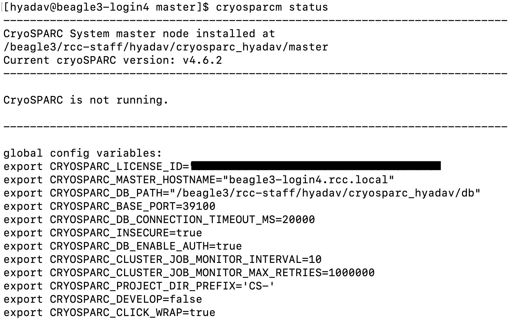
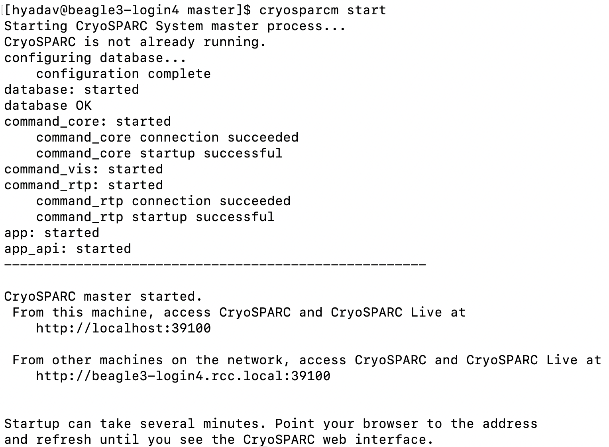

# CryoSPARC

CryoSPARC (Cryo-EM Single Particle Ab-Initio Reconstruction and Classification) is a state of the art software to process cryo-electron microscopy (cryo-EM) data. It is designed as a dispatcher for cryo-EM workloads on a group of servers and workstations. RCC provides support for CryoSPARC on the [Beagle3](../../beagle3-overview.md) cluster.

## Installation and Setup

To use CryoSPARC on Beagle3, you must first obtain a license from <a href='https://cryosparc.com/download' target='_blank'>CryoSPARC</a> and provide the license ID to RCC through either:

1. [This support form](https://rcc.uchicago.edu/support-and-services/consulting-and-technical-support){:target='_blank'}
2. Email: [help@rcc.uchicago.edu](mailto:help@rcc.uchicago.edu){:target='_blank'}

After receiving your license information, RCC will configure your account and provide:

1. Account credentials and setup details
2. A dedicated base port (typically in the range ``39100-39500``)
3. A designated host machine name (``beagle3-login3`` or ``beagle3-login4``)

## Getting Started

CryoSPARC's graphical user interface can be accessed through:

1. Your local machine's web browser (recommended for better performance)
2. [Thinlinc](../../thinlinc/main.md) 

### Initial Setup

1. **Log into your assigned host machine** (provided by RCC during account setup)
2. **Check CryoSPARC status** at any time using:

```
cryosparcm status
```
<figure markdown="span", align="center">
  { width="600" }
  <figcaption>CryoSPARC Status</figcaption>
</figure>

3. **Start CryoSPARC** if it's not already running:

```
cryosparcm start
```

<figure markdown="span", align="center">
  { width="600" }
  <figcaption>CryoSPARC Start</figcaption>
</figure>

### Accessing the GUI

Open a web browser (**preferably on your local machine for optimal performance**)  and navigate to your assigned host machine and port. The exact hostname is specified in the ``config.sh`` file located in the ``master`` folder of your installation directory.

!!! example "Example URL"
    ``http://beagle3-login4.rcc.local:39100/``

!!! warning "Important"
    **Always use the specific host machine name provided by RCC** to avoid service disruptions.

<div style="display: flex; justify-content: space-between; align-items: flex-start;">
  <figure style="width:48%; margin-right:2%; text-align: center;">
    
    <figcaption><b>Local Browser Access (Recommended)</b> - Better performance, faster response times.</figcaption>
  </figure>
  <figure style="width:48%; text-align: center;">
    
    <figcaption><b>Thinlinc Browser Access</b> - Useful when local network restrictions prevent direct access. Open Firefox within Thinlinc session</figcaption>
  </figure>
</div>
<figcaption style="text-align:center;"><b>CryoSPARC GUI Access Methods</b></figcaption>


## Troubleshooting

For comprehensive troubleshooting guidance, refer to the [official CryoSPARC troubleshooting documentation](https://guide.cryosparc.com/setup-configuration-and-management/troubleshooting). Below are solutions to common issues encountered on the Beagle3 cluster:

### Sock Error

If the error message looks like, 
```unix:///tmp/cryosparc-supervisor–6410667835282660811.sock refused connection (already shut down?)```, 
follow the steps mentioned below.

1. Run ```cryosparcm stop``` 

2. Delete ```/tmp/*.sock``` file that belongs to your user account. The exact name of the the ``*.sock`` file will be in the error message.

3. Kill any interfering zombie processes that are still running. You can find the process IDs using:
```
ps -ax | grep "supervisord" | grep $USER 
ps -ax | grep "cryosparc" | grep $USER 
ps -ax | grep "mongod" | grep $USER 
```
```
kill <PID>
```
4. Run ``cryosparcm start`` to start CryoSPARC again. 

### Database Failure:

1. Kill the mongo processes. You can find the process IDs using:

```ps -ax | grep “mongod”```
```kill <PID>```

2. Delete the ``.lock`` file at ``<cryosparc-install-dir>/db``

3. Start CryoSPARC again using:

```cryosparcm start```

### Database Spawn Error

If the error message looks like, 

```
Starting cryoSPARC System master process..
CryoSPARC is not already running.
database: ERROR (spawn error)
```

then follow the steps mentioned below

1. Make a complete copy of your ``db`` directory as a backup and keep it safe
```
cp -rav db db_backup
```

2. Stop CryoSPARC
```
cryosparcm stop
```

3. Remove the original folder 
```
rm -rf db
```

4. Kill zombie processes
```
ps -ax | grep "supervisord" | grep $USER 
ps -ax | grep "cryosparc" | grep $USER 
ps -ax | grep "mongod" | grep $USER 


5. Start cryosparc which  will recreate the database
```
cryosparcm start
```

6. Stop cryosparc 
```
cryosparcm stop
```

7. Run 
```
cp -rav db_backup db
```

8. ``cd`` into the ``db`` directory that has all your original database files and run the following bash commands
```
eval $(cryosparcm env)
```
```
mongod --dbpath ./ --repair
```

9. Start cryoSPARC again 
```
cryosparcm start
```


